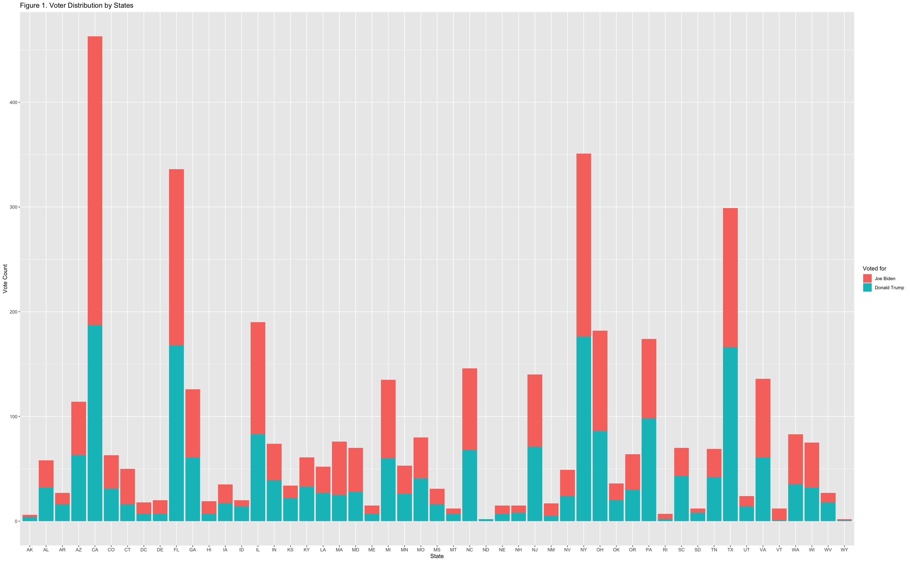

```{r setup, include=FALSE}
knitr::opts_chunk$set(echo = FALSE)
library(tidyverse)
library(kableExtra)
```

# Introduction

The 59^th^ annual presidential election in the United States is scheduled to be held on Tuesday, November 3, 2020. Voters will elect the presidential elector, who will vote on December 14, 2020 to elect the new president and vice president or the current presidents Donald Trump and Mike Pence respectively [@citeOnePhase]. Trump was nominated by the Republican Party, and Former Vice President Joe Biden won the Democratic nomination in a fiercely competitive primary [@citeSavvy]. This U.S. election is the most polarized one and the world pays attention to it.

The main goal of this report is to use multilevel regression with post-stratification (MRP) to predict the overall popular vote in the 2020 U.S. presidential election. MRP has become a widely used technique for estimations in national opinion polls, it is a statistical technique used to correct model estimation in estimating the known difference between the sample population (respondents in the survey) and the target population (American citizens who will vote in the election).

We used two surveys in our report, one is from the Democracy Fund + UCLA Nationscape [@citeNationscape]. This survey interviewed 500,000 Americans from July 2019 to December 2020, and its data covers the 2020 campaigns and elections. The other is from the American Community Surveys (ACS), which is the premier source for detailed population and housing information about the United States [@citeIPUMS], we used this as a post-stratification data. We will extend this in the Data section. After cleaning the two datas based on variables we selected, we built a post- stratification multilevel regression model to explain the vote intention based on the variables. Details will be in the Model section. 

We expected that Biden would win 55% of the overall popular vote. Our findings are essential because the election forecast has attracted the basic impulse of humans to peek into the future. People can't restrain their curiosity and will want to find out a way to get a certain answer before the result is released. Our finding is a proper answer for the audience with some degree of confidence. However, limitations exist too, for example, the sample size of the survey data is too small. More information will be in the Discussion section. Hopefully, they can rely on this report to foretell the 2020 U.S. election. 


# Data

The data set we used for post-stratification is collected from IPUM USA. The ACS [@citeIPUMS] can provide an information base for federal, state and local governments used for the management and evaluation of government programs. It can also provide timely demographics, housing, social and economic statistics updated yearly to be compared across states, communities and population groups. 

The census, which has been once every ten years, has been sent to about 17% of households in the U.S. Choose the size of the long sample can produce a reliable estimate of the small area. In full implementation, the ACS sample will contain approximately 3 million addresses nationwide each year. 

ACS PUMS housing unit records include all records in the supplementary sample and record samples in 31 test locations. The persons in the selected residential housing unit constitute the ACS PUMS personnel sample. For each state with test sites, the process of selecting housing units from test sites is performed independently.

Every month, a systematic sample is drawn to represent each U.S. county. The selected monthly samples will be mailed to ACS for investigation at the beginning of the month. One month later, the non-respondents were contacted by telephone for a computer-assisted telephone interview (CATI). Within one month of the CATI attempt, one-third of those who did not respond to email or telephone surveys were contacted in person for a computer-assisted personal interview (CAPI).

Although any one-year statistical data collected by ACS data may not provide a reliable estimate of the smallest area, the multi-year average will produce reliable, useful and timely statistical data. These multi-year averages will be updated annually to provide data users with a measure of changes over time, including changes for small regions and population groups. As with the decennial census and all household surveys conducted by the Census Bureau, all responses received from respondents are confidential; only information that meets the disclosure protection requirements will be publicly released.
Similar to the survey dataset, the variables we select from ACS are person weight, age group, gender, education level, state, household income, race, and labour force participation. We choose these variables not only because we are interested in those variables but also because they have a correspondence to the survey dataset. We can see what the data look like in Figure 2. Note that “perwt” in the data means the person weights on his/her vote. For example, the first response has a “perwt” of 75 that means his vote counts towards 75 votes in the larger world towards the candidate that this respondent prefers.

The survey data we analyzed is downloaded from UCLA Nationscape [@citeNationscape]. Nationscape is a survey conducted 500,000 interviews of Americans from July of 2019 to December of 2020 by researchers in UCLA. The contents of the survey are the 2020 campaigns and elections. Approximately 6,250 respondents were interviewed to do the survey in each week. The survey is divided into two phases. First phase ended on December 26, 2019 and the second phase ended on June 25, 2020.

To reach desired respondents, Nationscape collects samples from a market research platform called Lucid. This platform is used to run an online exchange for survey respondents. Once the respondents match the demographic targets (age, gender, income, ethnicity, region and education), they would be directly sent to a Nationscape’s survey software. The questions in the survey are also asked on large-sample government surveys so that Nationscape can compare the results.

After completing the survey, the survey data will be collected and weighted by a simple ranking technique to represent the American population instead of simple random sampling. Weighting targets are derived from the 2018 American Community Survey population over 18 years old, except for the 2016 vote. The weights covering the gender, census region, Hispanic ethnicity, race, education, age, household language, and country of birth are derived from comparing Nationscape survey’s responses with ACS targets’ responses. If respondents of Nationscape don’t respond, they will not be weighted to targets. 

We believe both the strengths and weaknesses of this survey dataset is weighting the data. This statistical technique can manipulate datasets through calculations in order to bring datasets more in line with the population being studied. It helps us to reduce inherent bias during data collection so that the results can represent the population more accurately . But the weakness of weighting data is that it will possibly make results or findings vary because of the increase in the standard deviation of the results. In another word, if the weighting variables are decreased, the risk of confusing data will also decrease. 

The variables we select from the survey dataset are vote preference in the 2020 U.S. election, age group, gender, education level, state, household_income, race, and labor force participation. We choose these variables because we are interested in whether or not those variables can affect the voting behaviour for some American citizens. Table 1 displays the first couple of responses along the variables of interest. Note that the last column `cell` in the table is a combination of `age group` and `race`. 

# Model

Our model is built using `R` [@citeR], with packages `tidyverse` [@citeTidyverse], `broom` [@citeBROOM], `tidybayes` [@citeTIDYBAYES], `caret` [@citeCARET], `ROCR` [@citeROCR], `brms` [@citeBRMS], and `lme4` [@citeLME4].

<!-- broom) -->
<!-- library(brms) -->
<!-- library(here) -->
<!-- library(tidybayes) -->
<!-- library(tidyverse) -->

We used multilevel regression with post-stratification to make the model. This technique essentially involves the use of census data from various types of people corresponding to different characteristics (we used age group, race, work, state, etc.) in the first step to estimate the substitution of these types with individuals. This relationship is then used in the second step to estimate the subregional substitution based on the number of people with certain types/features in the subregion (this process is called "post- stratification").

The model parameters we made based on the survey include age group, gender, family income, race, state, education level and work status. The reason we choose these parameters is that they can also find the corresponding parameters on census to better predict the next election. At the same time, the cell is also added to the variable, which is a combination of age group and gender to improve the accuracy of the model. We used caret package in R to find the confusion matrix.We then used lme4 package in R to build our model.

The reason why we didn't use ordinary regression is because the rough average of probability is not rigorous. Because the average value of probability is large, it does not mean that candidates have received more votes. A counterexample is: if there are only three voters, the probability of voting for Trump is 30%, 30%, 30%, 99%, 99%, and their weights are the same. Then the average value of probability is 57.6%. With the default value of 50% as the cutoff value, this result is equivalent to saying that Trump will get more than half of the votes. In fact, Trump's support rate is only 40%.

The method we use is equivalent to using probability to get the voting result of the individual level after predicting the result, and then counting the total votes in the unit of state instead of calculating the average value of probability. This method will avoid the above problems.


# Results

```{r results, fig.cap = "Table 4",echo = FALSE}
tbl <- data.frame(
  Vote = c("Joe Biden",
  "Donald Trump"),
  Reference = c(1339, 589),
  Prediction = c(844, 1473)
)

kbl(tbl) %>%
  kable_paper(full_width = F) %>%
  column_spec(1, bold = T, border_right = T) %>%
  column_spec(2,)
```

```{r}
source('compute.R')
confusion_matrix
```

```{r}
tbl2 <- data.frame(
  Vote = c("Joe Biden",
  "Donald Trump"),
  Win = c(298, 240)
)

kbl(tbl2) %>%
  kable_paper(full_width = F) %>%
  column_spec(1, bold = T, border_right = T) %>%
  column_spec(2,)
```

From the result we can see that the true postive rate for biden is 0.66 and the vote he gained is 298 over 538.

# Discussion

Biden will win the election in our predicition. The accuracy of the test set is about 66%, this means the audience can rely on our prediction in the 2020 U.S. election since we have a high accuracy. However, people may have intention to not to vote a popular candidate after seeing the poll result. People in this case, should not change their decision after seeing the report since this is just a statistical analysis but cintizens should rely on their impression about the candidats when voting.

More than 245 million Americans are eligible to vote but only a small number of people will really decide who the next president will be. That is because some states are solid towards one political party all the time. For example, Oregon, Massachusetts, Maryland and Michigan are states that usually support the Democratic Party. On the other hand, Alabama, Mississippi, Kansas and Idaho generally vote for Republican Party. Figure 1 shows the state distribution of voters who vote for either Trump or Biden and we can see they remain safe states for the parties. There are also some states that may lean their choice from one party to the others and those are the votes that will decide the actual win-lose in 2020 U.S. election.



## Insufficient Sample Size

The sample size for survey data is too small to be significant enough in representing the whole population. One more weakness correlated to the survey is that it was conducted months ago, the response may be different if we poll a survey right now. 

Usually we think that a very large sample size is a sign of quality, because it yields more accurate results. Although the principle still applies in theory, the reality is different. As Nate Cohn of The New York Times explained, “Usually, polls with large samples are actually just using cheap and problematic sampling methods.” The increase from biased sources is increasing bias itself. More interviews will not improve estimates. The goal is for us to get as much useful data as possible. This can be applied if we use easy-to-ask survey questions or take the survey personally. 

## Change in Voting Scheme 

The Maine Legislature passed a bill in August 2019 that adopted a ranked-choice voting [@citeRCV] for both the presidential primary and general elections. It is an election system in which voters can prioritize candidates based on their votes. If the candidate gets a majority of priority votes, he or she is declared the winner. If no candidate gets the majority of priority votes, the candidate with the least priority votes is eliminated. The first-priority vote for the failed candidates was eliminated, and the second-priority option indicated on those votes. A new count is performed to determine whether any candidates have won the adjusted majority [@citeRCV]. 

The process will repeat until the candidate wins an absolute majority. As a result, the implementation of RCV may delay the prediction of the winner of Maine's electoral vote within a few days after election day, and may complicate the interpretation of the national popular vote.

\newpage

# References


